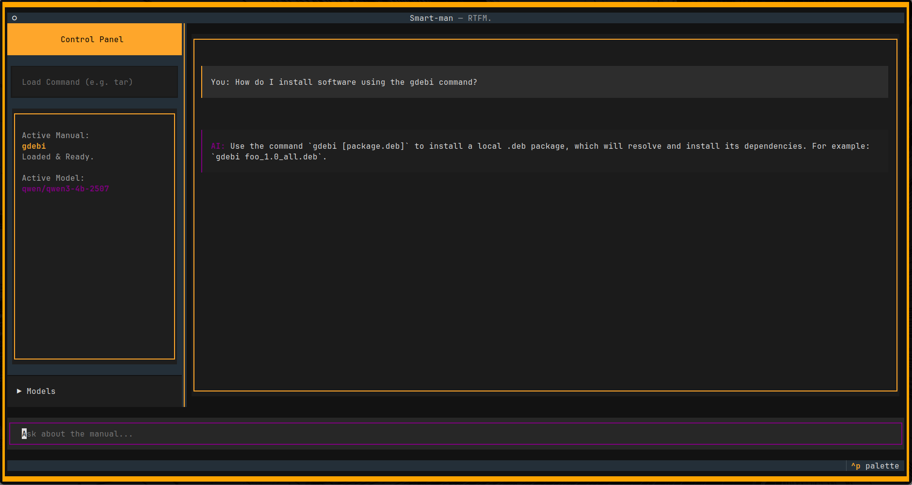

# smart-man

Simple python TUI for use of local LLMS directly interacting with man pages for augmented shell command assistance _on unix_.

The project reads in a man page, passes it as context to a local (or openAI compatible endpoint) LLM. With the man page loaded the model will answer questions about usage directly from the docs.

## Goals

- Learn `textual` for building python TUIs.
- Learn to use `openAI endpoints` with LMStudio instead of their python library.
- Scaffold a simple tool that I would actually consider using with local LLM.

### Features

- [x] Reads man pages
- [x] Feed man page to LLM
- [x] OpenAPI endpoint compatible
- [] Model selection
- [] Context info 

## Requirements

- **Unix-based OS**: as Shlex is designed with POSIX compliance in mind its worth mentioning that the docs do not guarantee compatibility or safe code execution on operating systems like windows. *Tested on MacOS 26.1 and Ubuntu 24LTS* 
- **OpenAI compatible endpoint**: This can take the form of a local model hosted via something like LMStudio or even vLLM, alternativley this should work with any openAI endpoints compatible endpoint. (_Model select to come_)
- **Python 3.10+** (Built on 3.10.19)